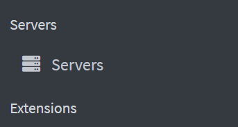
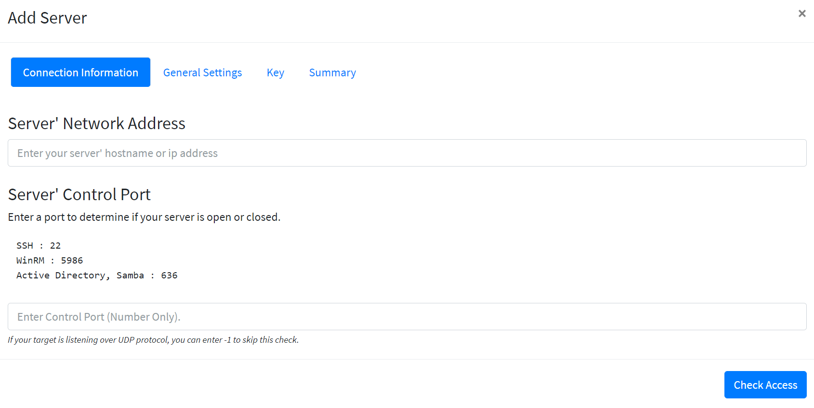
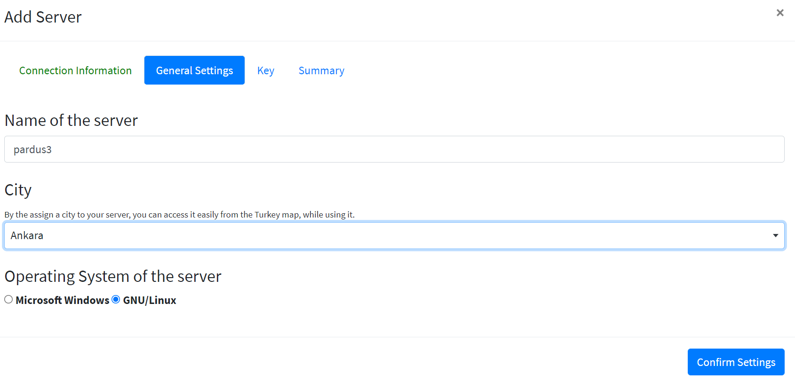
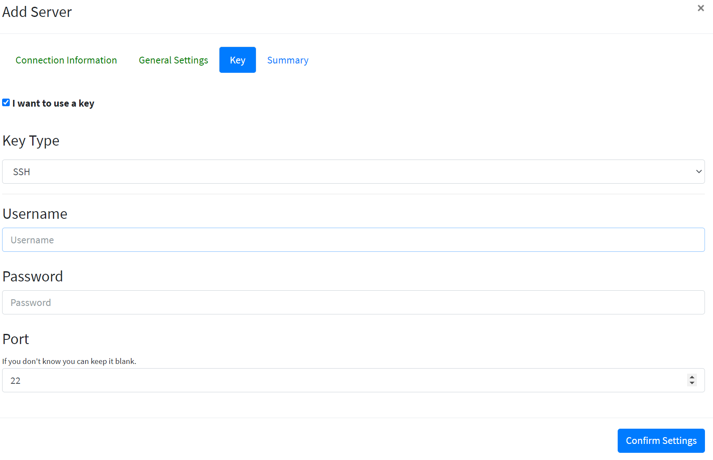

# How To Add Samba Server to Liman

Go to liman web interface and click **Servers**  from left menu.

Then click **Add** **Server** button.

Type ip address of your server that you want to add and type 22 to port section then click **Check Access **button.

Choose a name for your server and pick your city. Click **Confirm Settings**. In the **Key** tab you need to type your login information of your server.

At the end, click **Add Server**. Thats it! You have added your server to liman.

# How to Install Sambahvl Plugin with Upload

At first, download sambahvl zip file: https://github.com/zekiahmetbayar/liman-sambahvl/archive/refs/heads/main.zip

Go to your liman web interface and go to **System Settings** section from left menu.

Go to **Extensions** tab.

Click **Upload** button and choose the zip file that you have downloaded.

You have loaded sambahvl plugin to liman.

# How to Install Sambahvl Plugin from Extension Market

From the homepage of liman go to Extension Market.

Find SabmaHVL and click Upload. 

Confirm installation.

# How to Activate Sambahvl Extension for Samba Server

Go to liman web interface and click **Servers** from left menu.

Left click your samba server and go to **Extensions** tab.

Click the green '+' button and choose Sambahvl. Click **Add**.

You succesfully added the extension to your server.

Go to your Sambahvl extension from left menu.

Create domain name (ex. abc.lab) and password (must contain minimum 8 characters, at least 1 number and 1 word) to continue.

# How to Setup Sambahvl Packet using Sambahvl Plugin

Go to Sambahvl extension from left menu.

From **Installation** tab, click **Install SambaHvl Package** button.

Wait for setup to complete.

# How to Create Domain on Samba Server

Go to **Sambahvl** extension from left menu and

Click **Create Domain** button. You have successfully created domain.

