# Domain Eklentisi İçin Lisans Talebi

Liman arayüzünde sağ üstte bulunan Administrator kısmına basın. 

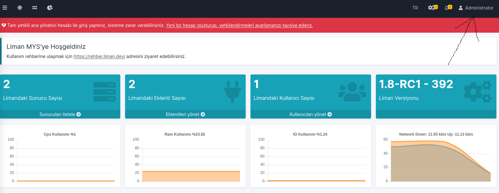

Orada gözüken Liman ID sini yetkililere iletin. 

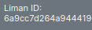

Yetkililerin bu ID yi kullanarak oluşturdukları lisansa eriştiğinizde Sistem Ayarları->Eklentiler tabına gidin. Domain eklentisi üstüne sağ tıklayıp **Lisans ekle**ye basın. Lisansınızı buraya girin ve **Ekleye** basın. 

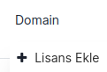

# Domain Eklentisi Nasıl Eklenir

Liman arayüzünde **Eklentileri Yönet** kısmına girin. 

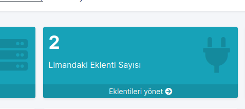Eklentiler tabına girdikten sonra **Yükle** butonuna basın ve Domain eklenti dosyasını seçin.

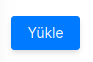 

Eklemek istediğiniz sunucunun eklenti ayarlarından Domain eklentisini sunucunuza ekleyebilirsiniz.

# Domain Eklentisinde İlk Bağlantı Nasıl Sağlanır

## Sertifika alma

Sistem ayarları -> Sertifikalar tabına girin.

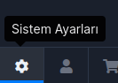

 **Sertifika Ekle** ye basın.

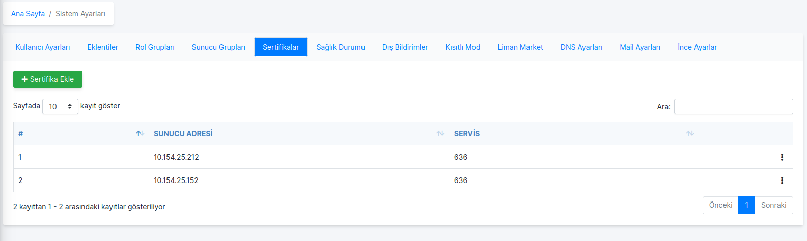

**Hostname** kısmına sunucu ip adresinizi **port** kısmına da 636 yazın ve **Al** deyin. 

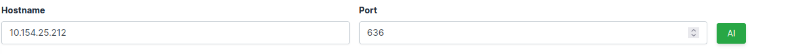

Sertifikayı onaylayın.

## Sunucu Anahtarı Güncelleme

Liman arayüzünden **Kasa** ya gidin. 

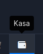**Sunucu Anahtarı**na sağ tıklayıp **Güncelle** deyin. 

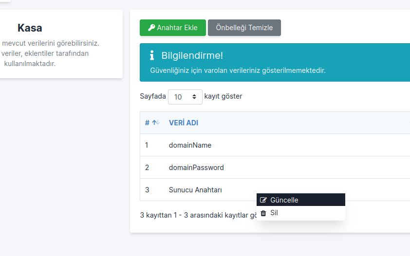Kullanıcı Adı: administrator Şifre: sizin şifreniz. **Anahtarı Ekle** ye basın.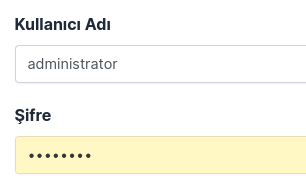

## DNS Ayarları 

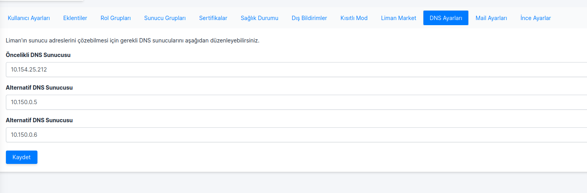

Sistem Ayarları -> DNS Ayarları tabından Öncelikli DNS Sunucusu kısmına Domain eklentisinin olduğu sunucu ip adresini girin. Kaydedin.

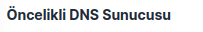

