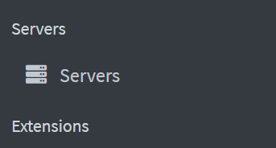
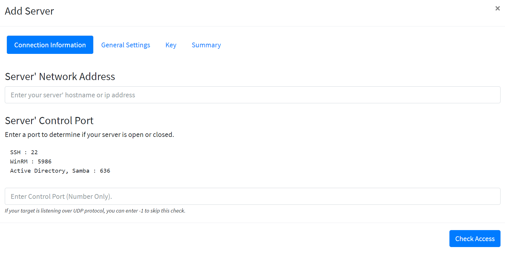
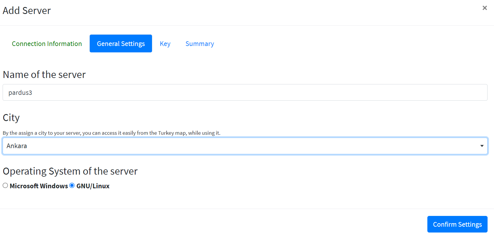
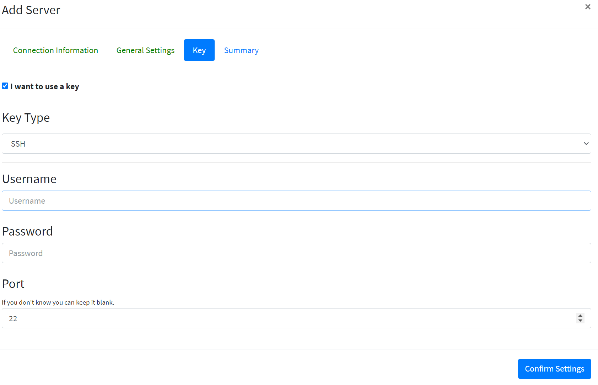

# How To Add Samba Server to Liman

Go to liman web interface and click **Servers**  from left menu.

Then click **Add** **Server** button.

Type ip address of your server that you want to add and type 22 to port section then click **Check Access **button.

Choose a name for your server and pick your city. Click **Confirm Settings**. In the **Key** tab you need to type your login information of your server.

At the end, click **Add Server**. Thats it! You have added your server to liman.

