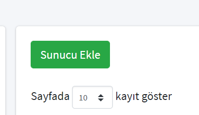

# How To Add Samba Server to Liman

Go to liman web interface and click "Sunucular"  from left menu.

Then click "Sunucu Ekle" button.

Type ip address of your server that you want to add and type 22 to port section then click "Bağlantıyı Kontrol Et" button.

Choose a name for your server and pick your city. Click "Ayarları Onayla". In the "Anahtar" tab you need to type your login informations of your server.

At the end, click "Sunucuyu Ekle". Thats it! You have added your server to liman.

