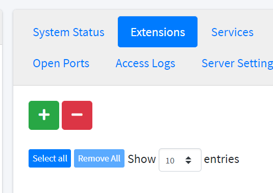
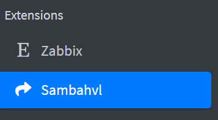
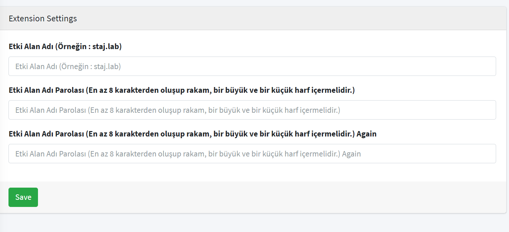

# How to Activate Sambahvl Extension for Samba Server

Go to liman web interface and click **Servers** from left menu.

Left click your samba server and go to **Extensions** tab.

Click the green '+' button and choose Sambahvl. Click **Add**.

You succesfully added the extension to your server.

Go to your Sambahvl extension from left menu.

Create domain name (ex. abc.lab) and password (must contain minimum 8 characters, at least 1 number and 1 word) to continue.

