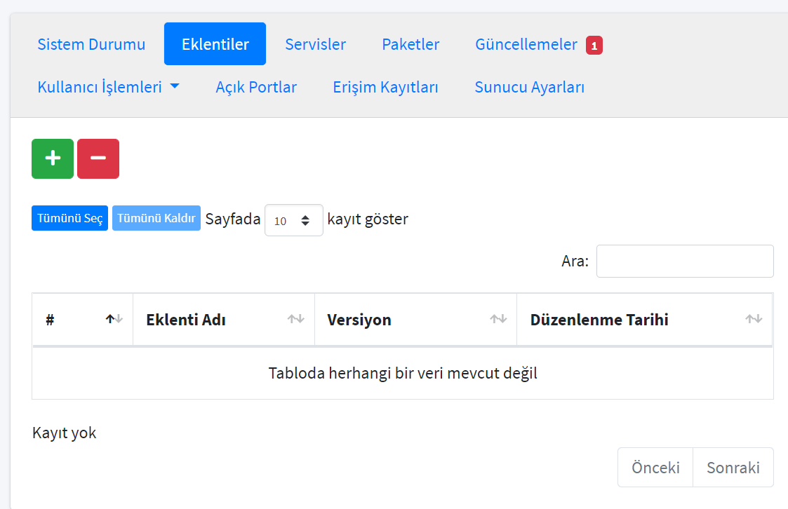

# How to Activate Sambahvl Plugin for Samba Server

Go to liman web interface and click 'Sunucular' from left menu.

Left click your samba server and go to 'Eklentiler' tab.

Click the green '+' button and choose Sambahvl. Click 'Ekle'.

You succesfully added the plugin to your server.

Go to your Sambahvl plugin from left menu.

Create domain name (ex. abc.lab) and password (must contain minimum 8 characters, at least 1 number and 1 word) to continue.

