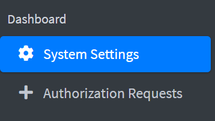

# How to Install Sambahvl Plugin

At first, download sambahvl zip file: https://github.com/zekiahmetbayar/liman-sambahvl/archive/refs/heads/main.zip

Go to your liman web interface and go to **System Settings** section from left menu.

Go to **Extensions** tab.

Click **Upload** button and choose the zip file that you have downloaded.

You have loaded sambahvl plugin to liman.

