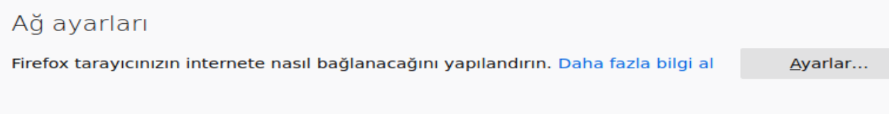
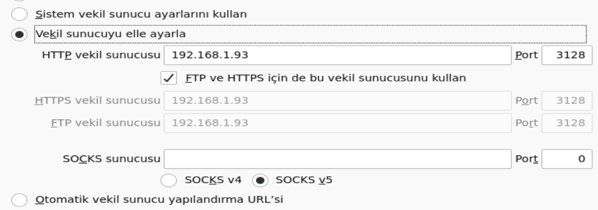
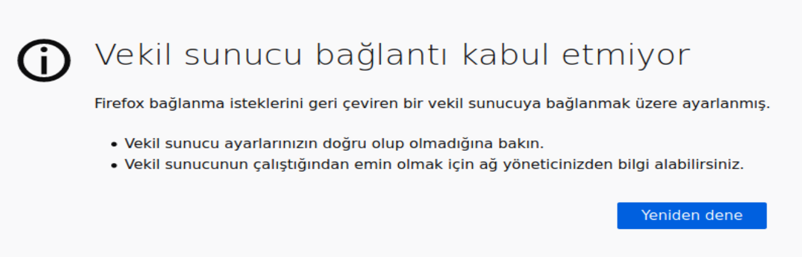

# Squid Proxy Kurulumu ve Site Bloklama

##  Squid nedir

Squid en çok kullanılan proxy serverlardan biridir. İnternet erişimini kontrol etme, trafik ve saldırı durumlarında ağ güvenliğini sağlama vb. alanlarda kullanılır. İstemci ve internet arasında bulunur ve istemciden yollanan talepler bu proxy sunucusu üzerinden yönlendirilir.

## 1- Hazır sunucuya squid kurulumu

 ### 1-Depoyu ve paketleri güncelleyelim

```
$ sudo apt update

$ sudo apt upgrade -y
```

​	

### 2-Squid indirelim

 ```
 $ sudo apt install squid
 ```


### 3-Konfigürasyon dosyasına gidelim

```
$ sudo nano /etc/squid/squid.conf
```

Aşağıdaki satırları bulalım ve değişiklikleri yapalım.(Dosya çok uzun olduğu için ctrl+w ile arama yapabilirsiniz.)

http_access allow localhost

http_access allow all 

ÖNEMLİ: Konfigürasyon dosyasında yaptığımız her değişiklikten sonra `systemctl restart squid`

diyerek servisi yeniden başlatmalıyız ki değişikliklerimiz uygulansın.

### 4-İstemcide firefoxumuzu ayarlayalım

Firefoxa girelim ve menüden Tercihlere gidelim.


Genel -> En alta inelim ve Ağ ayarlarına girelim



Vekil sunucuyu elle ayarlayı seçip proxy sunucumuzun ip adresini girin. Port kısmına da 3128 girin.

FTP ve HTTPS için de bu vekil sunucusunu kullan kutusunu işaretleyin.



## 2-Site Bloklama

### 1-Block.txt dosyasını oluşturma

```
cd /etc/squid/
touch block.txt
nano block.txt
```

içerisine www.youtube.com yazalım ve kaydedip çıkalım.

### 2-Konfigürasyon ayarı

`nano /etc/squid/squid.conf` 

Konfigürasyon dosyasında `#INSERT YOUR OWN RULE(S) HERE TO ALLLOW ACCESS` satırının altına 2 satır ekleyelim

`acl block dstdomain "/etc/squid/block.txt"`

`http_access deny block`

kaydedip çıkalim ve servisi yeniden başlatalım.

`systemctl restart squid`

  ### 3-Firefox üzerinden test etme

İstemcimizden firefoxa girelim ve www.youtube.com adresine gidelim.



İstediğimiz gibi siteye erişim reddediliyor.


